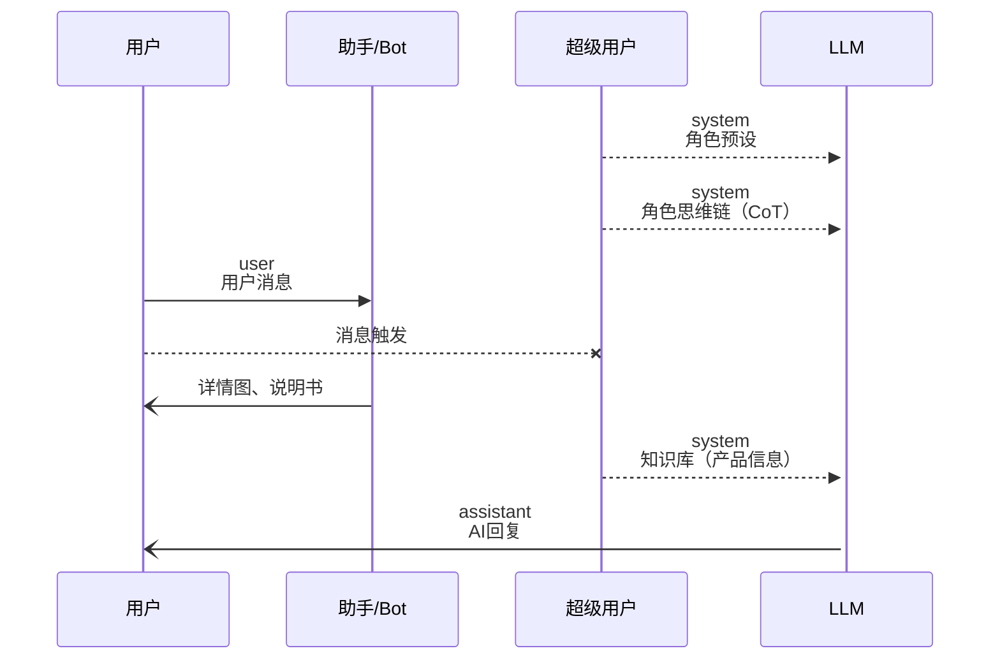

# koishi-plugin-sendimg

```mermaid
sequenceDiagram
    participant U as 用户
    participant A as 助手/Bot
    participant R as 超级用户
    participant S as LLM
    R-->>+S: system<br/>角色预设
    R-->>S: system<br/>角色思维链（CoT）
    U->>A: user<br/>用户消息
    U--xR: 消息触发
    A-)U: 详情图、说明书
    R-->>+S: system<br/>知识库（产品信息）
    S-)U: assistant<br/>AI回复

```

多类型图片返回机制

配置

|名称|数据类型|
|---|---|
|图库路径|string|
|特定前缀|string|

根据用户输入的消息，当满足特定前缀时，读取关键词，从图库（本地或远程）构造图片路径（图库+图片类型+产品名），以文件方式发送给用户。
